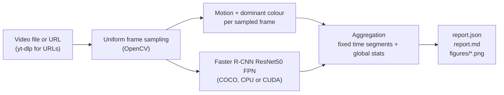

# Vision-X

A Python command-line video profiler: it samples frames from a video, measures motion and colour, runs Faster R-CNN object detection, and writes a per-segment JSON and Markdown report with figures.



No sample report or output images are committed to this repository yet (see [Report format](#report-format) and [Next steps](#limitations-and-next-steps)).

## What it does

- Loads a local video file, or downloads a URL with `yt-dlp`, and reads it with OpenCV.
- Samples up to `--max-frames` frames at evenly spaced indices.
- Computes a scalar motion value per sampled frame (mean absolute grayscale difference from the previous sampled frame) and the dominant colours of each frame.
- Detects the 80 COCO classes per frame with torchvision's Faster R-CNN ResNet50 FPN at a fixed confidence threshold of 0.5.
- Groups results into fixed-length time segments and a global summary, and writes JSON, Markdown, plots, and annotated sample frames.
- Needs no training and no labels; pretrained COCO weights are used as-is.

## How it works

1. **Load** (`video_profiler/video_io.py`). A string starting with `http://`, `https://` or `www.` is downloaded by invoking the `yt-dlp` executable (`--no-playlist`, format `best[ext=mp4]/best`) into `--download-dir` (default: system temp directory) as `vision_x_video_<id>.<ext>`. The file is opened with `cv2.VideoCapture`.
2. **Sample** (`video_io.py`). If the video has no more than `--max-frames` frames, all are used. Otherwise `numpy.linspace(0, total-1, max_frames)` gives the frame indices, which are read by seeking. Timestamps are `index / fps`.
3. **Motion and colour** (`video_profiler/motion.py`).
   - Motion: both frames are downscaled so the longest side is at most 320 px, converted to grayscale, and the mean absolute pixel difference (range 0 to 255) is taken. The first frame has motion 0. Because the difference is between consecutive *sampled* frames, the value depends on the sampling interval, not on the native frame rate.
   - Colour: each frame is shrunk by a factor of 4, pixels are quantised to 8 levels per channel (512 bins), and the 5 most populated bin centres are kept as that frame's palette.
4. **Detection** (`video_profiler/detection.py`). `torchvision.models.detection.fasterrcnn_resnet50_fpn(weights="DEFAULT")`, run in eval mode on one frame at a time with `torch.no_grad()`. Detections with score below 0.5 are dropped. The device is `--device` if given, otherwise CUDA when available, else CPU.
5. **Aggregation** (`video_profiler/aggregation.py`). Duration is last minus first sampled timestamp. Segments are consecutive windows of `--segment-window-sec` seconds; each reports mean and max motion, summed per-class detection counts, the maximum number of persons in any single frame, and the top 3 dominant colours (most frequent first-palette colour per frame, quantised to 32 levels). Global colours use the top 5 the same way.
6. **Report** (`video_profiler/report.py`). Writes `report.json`, `report.md`, and figures.

Each frame is detected independently. There is no per-object tracking or identity linking across frames.

## Quick start

Requirements (from `requirements.txt` and the code): Python 3.9 or newer (the `# Python 3.9+` note in `requirements.txt`), `opencv-python-headless>=4.8.0`, `numpy>=1.24.0`, `torch>=2.0.0`, `torchvision>=0.15.0`, `matplotlib>=3.7.0`, `yt-dlp>=2023.10.0`. The first run downloads the pretrained Faster R-CNN weights through torchvision, so it needs network access. A GPU is optional; without CUDA the detector runs on CPU, which is slower.

```bash
git clone https://github.com/sadeeqgandalf/Vision_X.git
cd Vision_X
python3 -m venv .venv && source .venv/bin/activate
pip install -r requirements.txt

# local file
python run_profiler.py --video /path/to/video.mp4

# URL (requires yt-dlp on PATH, installed by requirements.txt)
python run_profiler.py --video "https://www.youtube.com/watch?v=..."

# custom options
python run_profiler.py --video video.mp4 --output-dir ./out --max-frames 60 --segment-window-sec 15 --device cpu
```

A 3-second synthetic clip for a smoke test (a moving white circle on a changing background, so it is not expected to produce COCO detections) can be generated with `python scripts/make_test_video.py`, which writes `sample_video.mp4` in the repo root (git-ignored).

### Command-line arguments (`run_profiler.py`)

| Argument | Default | Meaning |
|----------|---------|---------|
| `--video`, `-v` | required | Local path or URL |
| `--output-dir`, `-o` | `./video_report` | Where the report and `figures/` are written |
| `--max-frames`, `-n` | `120` | Maximum number of sampled frames |
| `--segment-window-sec` | `10.0` | Segment length in seconds |
| `--device` | auto | `cpu` or `cuda` |
| `--download-dir` | system temp dir | Where URL downloads are saved |

The detection threshold (0.5) is hard-coded in `run_profiler.py`; it is not a CLI option. The program exits with code 1 if the video cannot be loaded or fewer than 2 frames are sampled.

## Report format

Everything is written under `--output-dir`.

| File | Contents |
|------|----------|
| `report.json` | `duration_sec`, `total_frames_analyzed`, `global_mean_motion`, `global_max_motion`, `global_object_counts` (class to total detections), `global_dominant_colors_rgb`, `n_segments`, and `segments[]`. Each segment has `start_sec`, `end_sec`, `mean_motion`, `max_motion`, `object_counts`, `person_count_max`, `frame_count`. Also `detections_with_bbox`: for the first 5 sampled frames, each detection's `class_name`, `score`, and `bbox_xyxy` in pixels. |
| `report.md` | Source path, a one-paragraph narrative summary (motion labelled low below a mean of 5, moderate below 15, otherwise high), global stats, a table of up to 30 segments, and a pointer to the bounding-box data. |
| `figures/motion_over_time.png` | Motion magnitude per sampled frame vs time |
| `figures/person_count_over_time.png` | Person detections per sampled frame vs time |
| `figures/color_palette.png` | Global dominant colour swatches (only written if colours exist) |
| `figures/detection_bbox_sample_01..03.png` | First, middle, and last sampled frames with boxes and scores drawn |

Notes: `object_counts` are summed detections over sampled frames, not counts of distinct objects. The labelled "total detections" figure in the narrative is the person detection total. Per-segment colours are computed but not written to the JSON or Markdown report.

Example output: not yet included in this repository.

## Project structure

```
run_profiler.py            # CLI entry point
requirements.txt
scripts/make_test_video.py # synthetic 3 s test clip
video_profiler/
  video_io.py              # load file/URL, metadata, uniform sampling
  motion.py                # frame-difference motion, dominant colours
  detection.py             # Faster R-CNN ResNet50 FPN (COCO)
  aggregation.py           # time segments and global statistics
  report.py                # JSON, Markdown, matplotlib figures, box overlays
```

## Limitations and next steps

Limitations, from the code:

- No tracking: detections are per frame and carry no object IDs, so counts cannot distinguish one object seen many times from many objects. Occlusion is not modelled.
- Motion is a global frame difference between sampled frames. It is not optical flow and does not separate camera motion from object motion.
- Sampling seeks to frame indices, so long videos are subsampled coarsely when `--max-frames` is small.
- Frames are processed one at a time, and all sampled frames are held in memory.
- No tests, no benchmarks, and no accuracy or speed measurements are included; none are claimed here.
- Detection is limited to the 80 COCO classes with a fixed 0.5 threshold.

Next steps (future work, not implemented):

- Add persistent track IDs by feeding detections to a tracker such as ByteTrack or SORT, then report per-track durations and distinct-object counts instead of per-frame counts. This would connect the profiler to multi-object tracking and make occlusion and re-identification gaps measurable.
- Commit a sample report and figures from a freely licensed video.
- Add unit tests for the sampling, motion, and aggregation functions.

## Tests

`pip install pytest && pytest tests/` runs 13 regression tests: colour binning without uint8 overflow, COCO label-id-to-name mapping (checked against torchvision's own list), and segment boundaries including the last frame. The full pipeline also runs end to end on the synthetic clip from `scripts/make_test_video.py`.

## Credits and licence

- Detection uses torchvision's Faster R-CNN ResNet50 FPN with its default pretrained weights (trained on COCO). torchvision is released under the BSD 3-Clause licence; the pretrained weights are provided by torchvision, and COCO annotations are licensed CC BY 4.0. Check the current torchvision documentation for the terms that apply to the weights you download.
- Ren, He, Girshick, Sun, "Faster R-CNN: Towards Real-Time Object Detection with Region Proposal Networks".
- Video download uses yt-dlp; respect the terms of service of the sites you download from.
- This project's own code is MIT licensed (see `LICENSE`).

## Related work

[lunar-occlusion-tracking](https://github.com/sadeeqgandalf/lunar-occlusion-tracking) by the same author, on tracking under occlusion.
